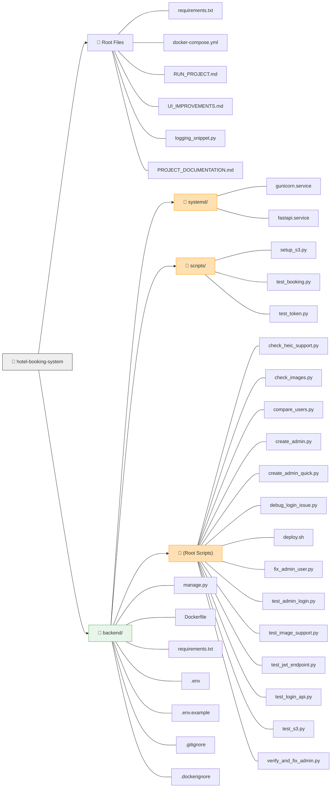
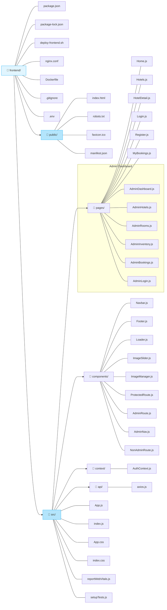
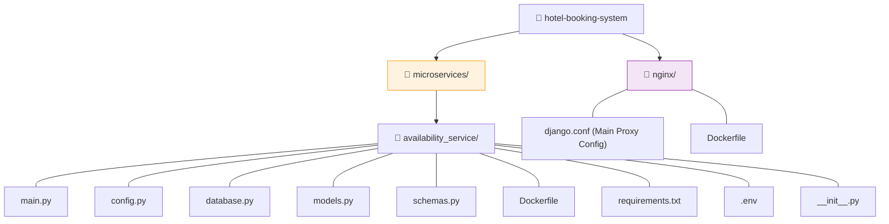

# Visual Project Structure (Complete & Exhaustive)

This document contains a visual map of **every single file** in your project, including configuration files and scripts.

## 1. Top Level & Backend Infrastructure

---

## 2. Django Apps (Business Logic)

```mermaid
graph LR
    Backend["📂 backend/"]

    %% Core App
    Backend --> Core["📂 core/"]
    Core --- C_Set["settings.py"]
    Core --- C_Urls["urls.py"]
    Core --- C_Wsgi["wsgi.py"]
    Core --- C_Asgi["asgi.py"]
    Core --- C_Init["__init__.py"]

    %% Hotels App
    Backend --> Hotels["📂 hotels/"]
    Hotels --- H_Mod["models.py"]
    Hotels --- H_Views["views.py"]
    Hotels --- H_Urls["urls.py"]
    Hotels --- H_Ser["serializers.py"]
    Hotels --- H_AdmViews["admin_views.py"]
    Hotels --- H_AdmUrls["admin_urls.py"]
    Hotels --- H_Bulk["bulk_inventory_serializer.py"]
    Hotels --- H_ImgMod["image_models.py"]
    Hotels --- H_ImgSer["image_serializers.py"]
    Hotels --- H_ImgViews["image_views.py"]
    Hotels --- H_Pag["pagination.py"]
    Hotels --- H_Admin["admin.py"]
    Hotels --- H_Apps["apps.py"]
    Hotels --- H_Tests["tests.py"]
    Hotels --- H_Mig["📂 migrations/"]

    %% Bookings App
    Backend --> Bookings["📂 bookings/"]
    Bookings --- B_Mod["models.py"]
    Bookings --- B_Views["views.py"]
    Bookings --- B_Ser["serializers.py"]
    Bookings --- B_Urls["urls.py"]
    Bookings --- B_Admin["admin.py"]
    Bookings --- B_Apps["apps.py"]
    Bookings --- B_Tests["tests.py"]
    Bookings --- B_Mig["📂 migrations/"]
    
    %% Users App
    Backend --> Users["📂 users/"]
    Users --- U_Mod["models.py"]
    Users --- U_Views["views.py"]
    Users --- U_Ser["serializers.py"]
    Users --- U_Urls["urls.py"]
    Users --- U_Admin["admin.py"]
    Users --- U_Apps["apps.py"]
    Users --- U_Tests["tests.py"]
    Users --- U_Sig["signals.py"]
    Users --- U_Mig["📂 migrations/"]
    
    style Backend fill:#e8f5e9,stroke:#4caf50
    style Hotels fill:#c8e6c9,stroke:#4caf50
    style Bookings fill:#c8e6c9,stroke:#4caf50
    style Users fill:#c8e6c9,stroke:#4caf50
    style Core fill:#c8e6c9,stroke:#4caf50
```

---

## 3. Frontend Application

---

## 4. Microservices & Nginx

